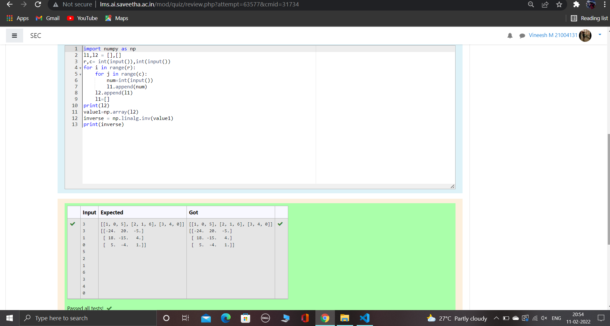

# Inverse-of-matrix

## AIM:
To write a python program to find the inverse of a matrix.

## ALGORITHM:
### Step 1:
To write a python program to find the inverse of a matrix.
### Step 2:
Enter the input.
### Step 3:
Use for loop and range.
### Step 4:
Use np.linalg.inv() to find inver of a matrix.
### Step 5:
print()
## PROGRAM:
~~~
import numpy as np
l1,l2 = [],[]
r,c= int(input()),int(input())
for i in range(r):
    for j in range(c):
        num=int(input())
        l1.append(num)
    l2.append(l1)
    l1=[]
print(l2)
value1=np.array(l2)
inverse = np.linalg.inv(value1)
print(inverse)
~~~
## OUTPUT:

## RESULT:
Thus the above program is executed sucessfully.
